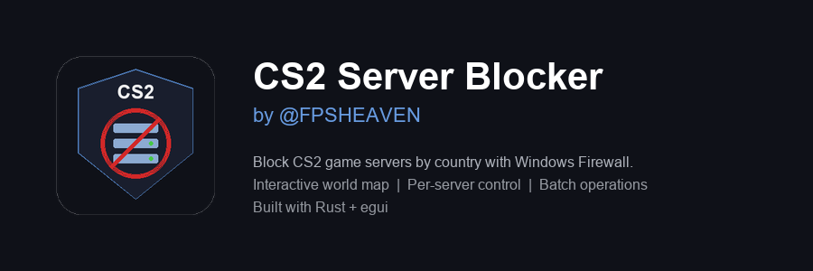

<p align="center">
  
</p>

<p align="center">
  <strong>Block Counter-Strike 2 server relays by country using Windows Firewall rules.</strong><br>
  Interactive world map &bull; Country controls &bull; Rule verification<br><br>
  
  
  
</p>

---

# CS2 Relay Blocker

CS2 Relay Blocker helps you control which Counter-Strike 2 Steam Datagram Relay regions your PC can reach by managing local Windows Firewall rules. Select countries, continents, or individual server relays to block, then verify that the expected firewall rules exist.

Server data is fetched live from the **Steam SDR (Steam Datagram Relay) API**, so the server list is always up to date.

> **Note:** This tool requires **Administrator privileges** to create/delete Windows Firewall rules.

Packaged builds are available on the [Releases page](https://github.com/fpsheaven/cs2serverblocker/releases). For the newest source fixes, build from `main` until the next release is published.


---

## Current Release Notes

- Replaced ICMP ping checks with firewall rule verification. Many relays ignore ping even when game traffic is allowed, so the app now checks the actual `CS2_Block_` Windows Firewall rules.
- Fixed stale block state after refreshes and block/unblock operations by resyncing firewall rules after changes.
- Fixed continent-level click actions and "block all except" bookkeeping.
- Improved large operations by splitting firewall changes into bounded PowerShell batches.
- Fixed country parsing for descriptions such as `Stockholm - Sweden` and U.S. state names like `Georgia`, `Illinois`, and `Washington`.

---

## Features

### Interactive World Map
- Dot-matrix world map showing all CS2 server locations
- **Green dots** = active servers, **Red dots** = blocked servers
- Hover over any dot to see server details: name, code, IPs, and port ranges
- Click a server dot to toggle block status
- Scroll to zoom and click-drag to pan

### Country & Continent Management
- Servers grouped by country and continent
- Color-coded status: **Red** = blocked, **Green** = active, **Orange** = partially blocked
- Checkbox selection for bulk block/unblock operations
- Continent-level checkbox to select all countries at once
- Click a country or continent name to toggle its block state
- **Block Selected / Unblock Selected / Unblock All** buttons

### Per-Server Control
- Countries with multiple servers have an expand button
- Block or unblock individual servers within a country
- See each server's description and current status

### Block All Except
- Per-continent dropdown: block every country in a continent except one
- Automatically unblocks the excepted country if it was previously blocked
- Hidden when all countries in a continent are already blocked

### Firewall Rule Verification
- Reads Windows Firewall rules and compares them to the app's expected state
- Per-server and per-country rule status summaries
- Status indicators: "Rules OK", "Rules missing", and "Unexpected block rule"
- Search for a server/country and use **Verify Listed Rules** to check the visible results
- Use the **Rules** button next to a country to verify every server in that country

### Batch Firewall Operations
- Firewall changes are split into bounded PowerShell batches for speed and command-line reliability
- Combines relay IPs per server, creating 4 rules per server instead of per-relay
- Supports both old and new rule formats
- Resyncs firewall state after every completed block/unblock operation

---

## Installation

### Prerequisites
- **Windows 10/11**
- **Rust toolchain** ([rustup.rs](https://rustup.rs))
- **Administrator privileges** for firewall rule management

### Build From Source

```powershell
git clone https://github.com/fpsheaven/cs2serverblocker.git
cd cs2serverblocker
cargo build --release
```

The executable will be at:

```powershell
.\target\release\cs2_server_blocker.exe
```

### Run

Right-click the executable and select **Run as Administrator**, or launch from an elevated terminal:

```powershell
.\target\release\cs2_server_blocker.exe
```

From a normal VS Code PowerShell terminal, build and request elevation in one command:

```powershell
cargo build --release; Start-Process -FilePath ".\target\release\cs2_server_blocker.exe" -Verb RunAs
```

For local UI/debug testing without firewall changes:

```powershell
cargo run
```

---

## Recommended Workflow

1. Launch the app as Administrator.
2. Let the app load the live Steam SDR server list and sync existing firewall rules.
3. Block the countries or continents you do not want.
4. Use **Refresh** after Steam server list changes or after updating the app.
5. Use **Rules** on a country, or search and use **Verify Listed Rules**, to confirm the firewall rules match the app state.
6. Start or restart CS2 after changing many regions so matchmaking sees the updated network conditions.

---

## How It Works

1. **Fetches server data** from the [Steam SDR Config API](https://api.steampowered.com/ISteamApps/GetSDRConfig/v1/?appid=730)
2. **Groups servers** by country and continent using geographic data and server descriptions
3. **Creates Windows Firewall rules** with `netsh advfirewall firewall` to block TCP/UDP traffic to selected relay IPs on their port ranges
4. **Syncs state** on startup and after changes by reading existing firewall rules with the `CS2_Block_` prefix
5. **Verifies rules** by comparing expected blocked/active app state against the actual Windows Firewall rules

### Firewall Rules Created

For each blocked server, 4 rules are created:

| Direction | Protocol | Rule Name |
|-----------|----------|-----------|
| Inbound   | TCP      | `CS2_Block_{code}` |
| Inbound   | UDP      | `CS2_Block_{code}` |
| Outbound  | TCP      | `CS2_Block_{code}` |
| Outbound  | UDP      | `CS2_Block_{code}` |

All relay IPs for a server are combined into a single `remoteip` parameter, and port ranges are merged to cover the widest range.


---
---

## FAQ

**Q: Does this affect my Steam account?**
A: No. This tool only creates local Windows Firewall rules. It does not modify any game files or interact with your Steam account.

**Q: Will I get VAC banned?**
A: No. This tool does not inject into or modify the game process. It only manages standard Windows Firewall rules, which is the same as manually creating rules through Windows settings.

**Q: What does firewall rule verification check?**
A: It reads the current `CS2_Block_` Windows Firewall rules and reports whether those rules match the app's expected blocked or active state.

**Q: Why did ping verification go away?**
A: ICMP ping is not a reliable test for CS2 relay reachability because some relays do not answer ping. Firewall rule verification is more direct for this app because it checks the rules the app actually manages.

**Q: I blocked Europe except London, but CS2 still placed me in Frankfurt or Amsterdam. What should I check?**
A: Run the latest source build as Administrator, click **Refresh**, then verify London, Frankfurt, and Amsterdam with **Rules** or **Verify Listed Rules**. If Frankfurt or Amsterdam shows "Rules missing", block it again. If rules are OK but matchmaking still routes there, restart CS2 and retest because matchmaking can reuse existing network/session state.

**Q: Can I block specific servers within a country?**
A: Yes. Click the expand button (`>`) next to countries with multiple servers to see and control individual servers.

**Q: How do I remove all rules created by the app?**
A: Run the app as Administrator and click **Unblock All**. The app removes rules with the `CS2_Block_` prefix, including older per-IP rule names from previous builds.

---

## License

[MIT, do whatever you want with it.](https://choosealicense.com/licenses/mit/)
